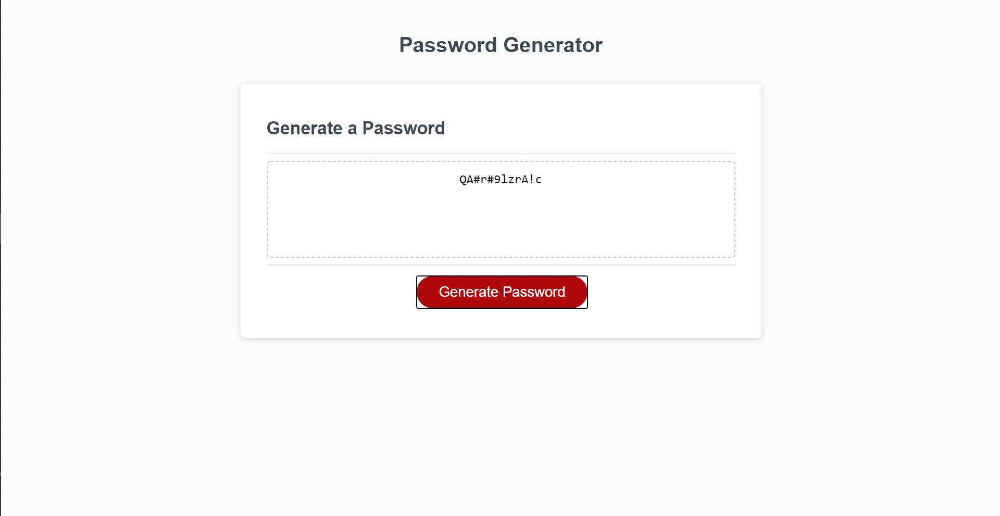

# Javascript-Random-Password-Generator

    <h4>
    </a>
    
    
        
    </h4>

This is a password generator application.

  <h4>
    <a href="https://github.com/ThomasMullaney/Javascript-Random-Password-Generatorr">
      Github Repository
    </a>
 | 
<a href="https://thomasmullaney.github.io/Javascript-Random-Password-Generator/">
      Github Pages
    </a>
  </h4>

## Description:
### A fun application to generate random passwords based off of user answers of prompts.

## Table of Contents:
     
1. [Installation](#installation)
2. [Usage](#usage)
3. [License](#license)
4. [Contributing](#contributing)
5. [Tests](#tests)
6. [Questions](#questions) 

## Installation: 
### Open index.html file within your web-browser.

## Usage:
### This application generates a random password based on the user-selected criteria. This application will run in the browser with a clean and polished user interface. This application is responsive, allowing it to adapt to multiple screen sizes, including mobile. An HTML validation service was used to ensure the page has valid HTML.

## License:
### 
    
## Contributing:
### Tom Mullaney

## Tests:
### 

    
## Questions:
### github.com/ThomasMullaney
### tloring.mullaney@gmail.com
    